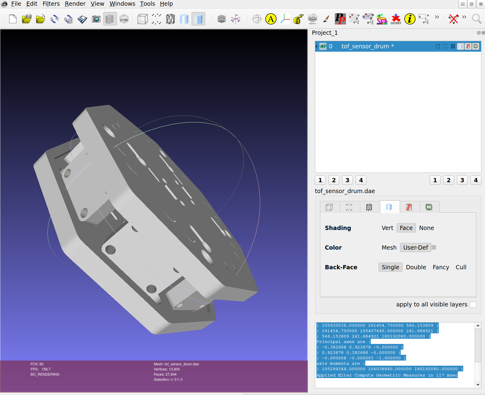

# Development of Quadcopter for Autonomous Navigation

## Table of Contents

## Abstract

Autonomous navigation is necessary for a robotic system to interact with its
surroundings in a real world environment, and it is necessary to realize
technologies such as fully autonomous unmanned aerial vehicles (UAVs) and land
vehicles. Reinforcement Learning (RL) has proven to be a novel and effective
method for autonomous navigation and control, as it is capable of optimizing a
method of converting its instantaneous state to an action at a point in time
(Gugan, 2023; Song, 2023; Doukhi, 2022). Here we use a Deep Deterministic Policy
Gradient (DDPG) RL algorithm to train the COEX Clover quadcopter system to
perform autonomous navigation. With the advent of solid state lasers,
miniaturized optical ranging systems have become ubiquitous for aerial robotics
because of their low power and accuracy (Raj, 2020). By equipping the Clover with
ten Time of Flight (ToF) ranging sensors, we supply continuous spatial data in
combination with inertial data to determine the quadcopter's state, which is
then mapped to its control output. Our results suggest that, while the DDPG
algorithm is capable of training a quadcopter system for autonomous navigation,
its computation-heavy nature leads to delayed convergence, and relying on
discretized algorithms may permit more rapid convergence across episodes.

---

Simon J. Jones  
Daniel Willey, PhD  
Janyl Jumadinova, PhD

Spring 2024

*Department of Physics*  
*Department of Computer and Information Science*  
*Allegheny College, Meadville, PA 16335*

## Goals of This Project

This project aims to train the COEX Clover quadcopter equipped with an array of
Time of Flight (ToF) sensors to perform basic navigation and obstacle avoidance
in randomized scenarios using a Deep Deterministic Policy Gradient (DDPG)
reinforcement learning algorithm. Using randomized environments will test the
effectiveness of curriculum learning for reinforcement learning and the overall
strengths and weaknesses of DDPG for quadcopter control.  By training the
quadcopter to explore randomized environments, this can also demonstrate how
using simpler, more economically affordable sensors can enable a quadcopter to
fly in a GPS-denied environment without the use of LiDAR, which is typically an
order of magnitude more expensive.

## Quick Start

The [clover_vm](https://github.com/CopterExpress/clover_vm) image is used to
perform all of the simulations in this project. In addition, it is helpful in
getting started simulating the Clover. The documentation can be found
[here](https://clover.coex.tech/en/simulation_vm.html).

For any information related to setup, see [Guides](#guides). If you feel that
something should be documented and isn't feel free to create an issue using
[this
link](https://github.com/ReadyResearchers-2023-24/SimonJonesArtifact/issues/new).

Assuming you have the `clover_vm` downloaded and have followed 
[the setup guide for `clover_train`](#clover_vm---setting-up-clover_train), you
can begin training by running the following command:

```sh
roslaunch clover_train train.py
```

This will run 1,000 training episodes in the 10 procedurally generated worlds
located in `src/pcg/resources/worlds`. If you feel adventurous, try [generating
your own worlds using the `pcg`
package](#procedurally-generating-rooms-using-pcg-module-and-pcg_gazebo), which
is also a part of this project!

### Project Design

The chosen quadcopter platform is the COEX Clover drone, which uses open source
software, ideal for our purpose (Express). The Clover can be
integrated with any sensor thanks to its on-board Raspberry Pi 4 (RPi4); thus,
we will opt to use an array of ToF sensors to measure spatial data. This is, by
definition, a LiDAR system. The Clover supports the MAVROS protocol, which
permits a communication channel between the on-board computer (RPi4) and the
drone’s flight controller. The Clover also supports the *Robotic Operating
System* (ROS), which is a collection of software and methodologies that
generalize robotics development. (Stanford Artificial Intelligence Laboratory et
al.)

<figure>

<figcaption aria-hidden="true">COEX Clover quadcopter. <span
class="citation" data-cites="clover">(<span>Express</span>
)</span></figcaption>
</figure>

# Guides

## Installing VirtualBox - Ubuntu 22.04

VirtualBox is the platform used to run all of the programs listed in this
project. In addition, all of the simulation was performed using the `clover_vm`
VirtualBox environment, which can be found at
https://github.com/CopterExpress/clover_vm. [See
here](https://www.virtualbox.org/wiki/Linux_Downloads#Debian-basedLinuxdistributions)
for information from VirtualBox.  

In order to install VirtualBox, one can follow these steps:

* Download VirtualBox public key, convert to a GPG key, and add to keyring.

  ```sh
  wget -O- https://www.virtualbox.org/download/oracle_vbox_2016.asc | sudo gpg --dearmor --yes --output /usr/share/keyrings/oracle-virtualbox-2016.gpg
  ```

* Add VirtualBox's package list to the system.

  ```sh
  sudo echo "deb [arch=amd64 signed-by=/usr/share/keyrings/virtualbox.gpg] https://download.virtualbox.org/virtualbox/debian jammy contrib" > /etc/apt/sources.list.d/virtualbox.list
  ```

* Install VirtualBox.

  ```sh
  sudo apt update
  sudo apt install virtualbox-7.0
  ```

* NOTE: before running, check if `virtualbox-dkms` is installed. You don't want
  it installed. (see [this askubuntu article](https://askubuntu.com/questions/900794/virtualbox-rtr3initex-failed-with-rc-1912-rc-1912))

  ```sh
  dpkg -l | grep virtualbox-dkms
  ```

  * If this command shows that `virtualbox-dkms` was found in your system,
    uninstall it and install the package `dkms`.

    ```sh
    sudo apt-get purge virtualbox-dkms
    sudo apt-get install dkms
    ```

  * Now, rebuild VirtualBox kernel modules.

    ```sh
    sudo /sbin/vboxconfig
    ```

* Otherwise, you can now run VirtualBox

  ```sh
  VirtualBox
  # or
  VirtualBoxVM --startvm <vm-name>
  ```

## Using `clover_vm` for simulating Clover

The [clover_vm](https://github.com/CopterExpress/clover_vm) image is used to
perform all of the simulations in this project. In addition, it is helpful in
getting started simulating the Clover. The documentation can be found
[here](https://clover.coex.tech/en/simulation_vm.html).

### `clover_vm` - Setup

* Download `clover_vm` image from
  [releases page](https://github.com/CopterExpress/clover_vm/releases/). Select
  the latest release and download. These are multigigabyte files, so they will be
  time consuming to download. Ensure you have enough space.
* Ensure you have VirtualBox installed. See
  [Installing VirtualBox - Ubuntu 22.04](#installing-virtualbox---ubuntu-2204)
  for details.
* Set up the `clover_vm`. Note that this can be done through using
  `virtualbox`'s GUI.

  ```sh
  vboxmanage import /path/to/clover_vm.ova
  ```

* Launch `virtualbox`

  ```sh
  VirtualBoxVM --startvm clover-devel
  ```

* Select the image named **clover-devel**.
* Change its settings such that it has at least 4GB of memory and, preferably,
  as many cores as your system.
* Now that the image is fully configured, select **Start**.

### `clover_vm` - General Usage

* In the virtual machine, Open a terminal and launch the simulation. Sourcing
  will already be done, because the virtual machine is preconfigured. This opens
  a Gazebo instance and a PX4 SITL simulation in the console. The Gazebo
  instance is what you'll want to refer back to.

  ```sh
  roslaunch clover_simulate simulator.launch
  ```

* In a new terminal, run one of the python scripts in `~/examples/` using `python3`.

  ```sh
  python3 examples/flight.py # this is a fun one
  ```

* Refer back to the open Gazebo instance to see the drone begin to arm. The
  expected behavior is that the drone takes off, moves one meter horizontally,
  and lands again.
* Now you've demonstrated that your system can simulate the Clover!

### `clover_vm` - Setting up `clover_train`

In the Clover VM, open up a terminal and clone the repository for this project:

```sh
git clone --recursive https://github.com/ReadyResearchers-2023-24/SimonJonesArtifact.git /home/clover/SimonJonesArtifact
```

Then run `catkin_make` and source the development shell file to add the ROS
packages to your PATH:

```sh
cd /home/clover/SimonJonesArtifact
catkin_make
source devel/setup.bash
```

Once this has finished building, you can now install the python files used in
the `clover_train` package:

```sh
python3 -m pip install tensorflow[and-cuda]
python3 -m pip install numpy
```

The rest of the python modules are made available directly through `catkin`. You
can verify if you have successfully set up the packages by running the
following:

```sh
rosrun clover_train launch_clover_simulation
```

This will open a Gazebo instance and spawn the Clover into it. Any issues
encountered during this process can be posted to
[this link](https://github.com/ReadyResearchers-2023-24/SimonJonesArtifact/issues/new).

## Preparing `.STL` Files for Simulation

In order to use an `.STL` file in a robotics simulation, its inertial and
collision properties must first be known. If the geometry of the object is
symmetric and a physical model has been fabricated, this process is much more
straightforward; however, in most cases, processing the mesh will be necessary.
In this project, the inertia tensor and collision box of the custom 3D model
used for mounting the ToF sensors was calculated using Blender 4.0.2 and Meshlab
2022.02.

### Exporting to COLLADA using Blender

Assuming the `.STL` file already exists, it can first be imported into
blender by navigating to `Import -> STL (.stl) (experimental)`. Make sure to
remove any pre-existing models from the scene by deleting them from the scene
collection window.

If there is complex geometry in the part, it may be worth simplifying the number
of vertices by decimating the mesh. This simplifies the geometry by removing
edges and vertices that may be redundant. A part can be decimated by navigating
to `Modifiers -> Add Modifier -> Generate -> Decimate`. Pictured below, an
example part is decimated using the "Planar" method, but other methods may be
used. By increasing the `Angle Limit` parameter, the value of `Face Count` is
greatly reduced. After the desired number of faces is achieved, typing
`Ctrl + A` will apply the modifier to the part.


Once the mesh is simplified to one's needs, it can be exported in the COLLADA
format by navigating to `File -> Export -> Collada (.dae)`.

### Calculating Inertial Values using MeshLab



After opening MeshLab, navigate to `File -> Import Mesh` to import the COLLADA
file. Then, selecting

```txt
Filters
-> Quality Measure and Computations
  -> Compute Geometric Measures
```

will print the physical properties of the mesh in the lower-right log:

```txt
Mesh Bounding Box Size 101.567337 101.567337 30.500050
Mesh Bounding Box Diag 146.840393 
Mesh Bounding Box min -50.783676 -50.783672 -0.000002
Mesh Bounding Box max 50.783665 50.783669 30.500048
Mesh Surface Area is 60501.800781
Mesh Total Len of 41916 Edges is 175294.890625 Avg Len 4.182052
Mesh Total Len of 41916 Edges is 175294.890625 Avg Len 4.182052 (including faux edges))
Thin shell (faces) barycenter: -0.011143 0.026900 15.249686
Vertices barycenter 0.036033 -0.086995 15.250006
Mesh Volume is 121008.421875
Center of Mass is -0.008342 0.020133 15.250009
Inertia Tensor is :
| 105930536.000000 261454.750000 566.153809 |
| 261454.750000 105407640.000000 241.684921 |
| 566.153809 241.684921 180192080.000000 |
Principal axes are :
| -0.382688 0.923878 -0.000000 |
| 0.923878 0.382688 -0.000008 |
| -0.000008 -0.000003 -1.000000 |
axis momenta are :
| 105299344.000000 106038840.000000 180192080.000000 |
Applied filter Compute Geometric Measures in 117 msec
```

The inertia tensor is displayed assuming that $m_{\text{object}} =
V_{\text{object}}$, so re-scaling the values is required. An explanation of how
to do so can be found at
\url{https://classic.gazebosim.org/tutorials?tut=inertia}.

## Procedurally Generating Rooms Using `pcg` Module and `pcg_gazebo`

In order to test the robustness of a model, it is helpful to evaluate its
performance in random environments. In the Clover VM, this can be done by using
the `pcg_gazebo` package, created by Bosch Research [@manhaes2024]. A wrapper
for this package exists under
https://github.com/ReadyResearchers-2023-24/SimonJonesArtifact in the
directory `src/pcg`.

### Using `pcg` for Room Generation

After cloning
https://github.com/ReadyResearchers-2023-24/SimonJonesArtifact to the
Clover VM, create a Python virtualenv in the `pcg` root directory and install
from `requirements.txt`:

```sh
cd /path/to/SimonJonesArtifact/src/pcg
python3 -m virtualenv venv
pip install -r requirements.txt
```

Now that you have all of the necessary packages, assuming that you have properly
sourced your shell in `SimonJonesArtifact/devel`, you can run the `generate`
script under `pcg`:

```sh
rosrun pcg generate -h
```

If this works correctly, you should see a help output describing the possible
CLI flags. To generate ten worlds, saving them to the `.gazebo/` directory, you
can run the following command:


```sh
rosrun pcg generate \
  --models-dir=/home/clover/.gazebo/models \
  --worlds-dir=/home/clover/.gazebo/worlds \
  --num-worlds=1
```

However, by default, the generated worlds are stored to
`/path/to/SimonJonesArtifact/src/pcg/resources/worlds`, and the models are
stored at `/path/to/SimonJonesArtifact/src/pcg/models`. This allows them to be
incorporated into the project's ROS path by default.

### Installing `pcg_gazebo`

For manually using `pcg_gazebo` without the custom `pcg` module, you must
install `pcg_gazebo`. To install `pcg_gazebo` on the Clover VM, start by
updating the system:

```sh
sudo apt-get update
sudo apt upgrade
```

Then install supporting packages:

```sh
sudo apt install libspatialindex-dev pybind11-dev libgeos-dev
pip install "pyglet<2"
pip install markupsafe==2.0.1
pip install trimesh[easy]==3.16.4
```

Then, you may need to update `pip`, as the version that comes by default in the
VM is not up to date:

```sh
sudo pip install --upgrade pip
```

Then install the `pcg_gazebo` package:

```sh
pip install pcg_gazebo
```

Before running, make sure to create the default directory where the tool will
save the world files, `~/.gazebo/models`:

```sh
mkdir -p ~/.gazebo/models
```

### Running `pcg_gazebo`

For a basic cuboid room, one can run the following:

```sh
pcg-generate-sample-world-with-walls \
  --n-rectangles 1 \
  --world-name <your-world-name> \
  --preview
```

This will generate the world file `~/.gazebo/models/<your-world-name>.world`
that contains a cuboid.

Other examples, that incorporate randomly placed obstacles, are shown in the
following:

```sh
pcg-generate-sample-world-with-walls \
  --n-rectangles 10 \
  --n-cubes 10 \
  --world-name <your-world-name> \
  --preview
pcg-generate-sample-world-with-walls \
  --n-rectangles 10 \
  --x-room-range 6 \
  --y-room-range 6 \
  --n-cubes 15 \
  --wall-height 6 \
  --world-name <your-world-name> \
  --preview
pcg-generate-sample-world-with-walls \
  --n-rectangles 10 \
  --n-cylinders 10 \
  --world-name <your-world-name> \
  --preview
pcg-generate-sample-world-with-walls \
  --n-rectangles 10 \
  --n-spheres 10 \
  --world-name <your-world-name> \
  --preview
```

# References

(1) Hodge, V. J.; Hawkins, R.; Alexander, R. Deep Reinforcement Learning for Drone Navigation Using Sensor Data. Neural Computing and Applications 2021, 33, 2015–2033.  
(2) Koyama, F. Advances and New Functions of VCSEL Photonics. Optical Review 2014, 21, 893–904.  
(3) Bernini, N.; Bessa, M.; Delmas, R.; Gold, A.; Goubault, E.; Pennec, R.; Putot, S.; Sillion, F. A Few Lessons Learned in Reinforcement Learning for Quadcopter Attitude Control. In Proceedings of the 24th International Conference on Hybrid Systems: Computation and Control; HSCC ’21; Association for Computing Machinery: Nashville, Tennessee, 2021. https://doi.org/10.1145/3447928.3456707.  
(4) Iga, K. Surface-Emitting Laser-Its Birth and Generation of New Optoelectronics Field. IEEE Journal of selected topics in Quantum Electronics 2000, 6 (6), 1201–1215.  
(5) Mur, U.; Ravnik, M.; Seč, D. Controllable Shifting, Steering, and Expanding of Light Beam Based on Multi-Layer Liquid-Crystal Cells. Scientific reports 2022, 12 (1), 352.  
(6) Raj, T.; Hanim Hashim, F.; Baseri Huddin, A.; Ibrahim, M. F.; Hussain, A. A Survey on LiDAR Scanning Mechanisms. Electronics 2020, 9 (5), 741.  
(7) Zhang, G.; Elston, S. J.; Schreier, A.; Faulkner, G.; Surampudi, A.; O’Brien, D.; Morris, S. M. Non-Mechanical Optical Beam-Steering of a Liquid Crystal Laser. Optics & Laser Technology 2023, 157, 108623.  
(8) Sciortino, C.; Fagiolini, A. ROS/Gazebo-Based Simulation of Quadcopter Aircrafts. In 2018 IEEE 4th International Forum on Research and Technology for Society and Industry (RTSI); IEEE, 2018; pp 1–6.  
(9) de Oliveira, R. M. Identification and Validation of a Quadrotor’s Model Dynamics. Tech. Rep. 2014.  
(10) Song, Y.; Romero, A.; Müller, M.; Koltun, V.; Scaramuzza, D. Reaching the Limit in Autonomous Racing: Optimal Control versus Reinforcement Learning. Science Robotics 2023, 8 (82), eadg1462.  
(11) Zhu, K.; Zhang, T. Deep Reinforcement Learning Based Mobile Robot Navigation: A Review. Tsinghua Science and Technology 2021, 26 (5), 674–691.  
(12) Bogatov, N.; Kostin, A.; Maiorov, N. Control and Analysis of Quadcopter Flight When Setting a Complex Trajectory of Motion. In Journal of Physics: Conference Series; IOP Publishing, 2021; Vol. 1925, p 012043.  
(13) Express, C. COEX Clover https://clover.coex.tech/en/ (accessed 2010 -10 -01).  
(14) Li, N.; Ho, C. P.; Xue, J.; Lim, L. W.; Chen, G.; Fu, Y. H.; Lee, L. Y. T. A Progress Review on Solid-State LiDAR and Nanophotonics-Based LiDAR Sensors. Laser & Photonics Reviews 2022, 16 (11), 2100511.  
(15) Saleh, B. E.; Teich, M. C. Fundamentals of Photonics; John Wiley & sons, 2019.  
(16) Cirtoaje, C. Ferroelectric Particles in Nematic Liquid Crystals with Soft Anchoring. Molecules 2021, 26 (4). https://doi.org/10.3390/molecules26041166.  
(17) Stanford Artificial Intelligence Laboratory et al. Robotic Operating System.  
(18) Robotics, O. Gazebo.  
(19) Abadi, M.; Agarwal, A.; Barham, P.; Brevdo, E.; Chen, Z.; Citro, C.; Corrado, G. S.; Davis, A.; Dean, J.; Devin, M.; Ghemawat, S.; Goodfellow, I.; Harp, A.; Irving, G.; Isard, M.; Jia, Y.; Jozefowicz, R.; Kaiser, L.; Kudlur, M.; Levenberg, J.; Mané, D.; Monga, R.; Moore, S.; Murray, D.; Olah, C.; Schuster, M.; Shlens, J.; Steiner, B.; Sutskever, I.; Talwar, K.; Tucker, P.; Vanhoucke, V.; Vasudevan, V.; Viégas, F.; Vinyals, O.; Warden, P.; Wattenberg, M.; Wicke, M.; Yu, Y.; Zheng, X.  TensorFlow: Large-Scale Machine Learning on Heterogeneous Systems; 2015.  
(20) Li, P. Z. X.; Karaman, S.; Sze, V. Memory-Efficient Gaussian Fitting for Depth Images in Real Time. In 2022 International Conference on Robotics and Automation (ICRA); IEEE, 2022; pp 8003–8009.  
(21) Pedrotti, F. L.; Pedrotti, L. S. Introduction to Optics; Henderson, R., Ed.; Prentice Hall, 1993; pp 426–453.  
(22) Shakhatreh, H.; Sawalmeh, A. H.; Al-Fuqaha, A.; Dou, Z.; Almaita, E.; Khalil, I.; Othman, N. S.; Khreishah, A.; Guizani, M. Unmanned Aerial Vehicles (UAVs): A Survey on Civil Applications and Key Research Challenges. IEEE Access 2019, 7, 48572–48634.  
(23) Cummings, A. R.; McKee, A.; Kulkarni, K.; Markandey, N. The Rise of UAVs. Photogrammetric Engineering & Remote Sensing 2017, 83 (4), 317–325.  
(24) Chávez, K. Learning on the Fly: Drones in the Russian-Ukrainian War. Arms Control Today 2023, 53 (1), 6–11.  
(25) Gugan, G.; Haque, A. Path Planning for Autonomous Drones: Challenges and Future Directions. Drones 2023, 7 (3), 169.  
(26) Administration, F. A. FAA Aerospace Forecasts 2023-2043 https://www.faa.gov/sites/faa.gov/files/2023-Unmanned\%20Aircraft\%20Systems\%20and\%20Advance\%20Air\%20Mobility_0.pdf (accessed 2023 -12 -02).  
(27) Martin, S. Triathlete Hit in Head by Drone http://www.runnersworld.com/newswire/triathlete-hit-in-head-by-drone (accessed 2023 -12 -02).  
(28) Telegraph, T. Serbia v Albania abandoned following mass brawl after drone flies over stadium carrying Albanian flag. https://www.telegraph.co.uk/sport/football/euro-2016/11163216/Serbia-v-Albania-abandoned-following-mass-brawl-after-drone-flies-over-stadium-carrying-Albanian-flag.html (accessed 2023 -12 -02).  
(29) Jansen, B. FAA: Drone sightings on pace to quadruple this year. http://www.usatoday.com/story/news/2015/08/13/drone-sightings-faa-newark/31614151/ (accessed 2023 -12 -02).  
(30) Berman, R. Beware the Drone Laws http://www.theatlantic.com/politics/archive/2015/01/beware-the-drones-white-house-obama/384869/ (accessed 2023 -12 -02).  
(31) Anderson, K.; Gaston, K. J. Drone `containing radiation’ lands on roof of Japanese PM’s office https://www.theguardian.com/world/2015/apr/22/drone-with-radiation-sign-lands-on-roof-of-japanese-prime-ministers-office (accessed 2023 -12 -02).  
(32) Khalil, A. A.; Rahman, M. A. FED-UP: Federated Deep Reinforcement Learning-Based UAV Path Planning against Hostile Defense System. In 2022 18th International Conference on Network and Service Management (CNSM); IEEE, 2022; pp 268–274.  
(33) Johnston Huntington, T.; Eckert, A. E. ‘We Watched His Whole Life Unfold... Then You Watch the Death’: Drone Tactics, Operator Trauma, and Hidden Human Costs of Contemporary Wartime. International Relations 2022, 36 (4), 638–657.  
(34) Doukhi, O.; Lee, D. J. Deep Reinforcement Learning for Autonomous Map-Less Navigation of a Flying Robot. IEEE Access 2022, 10, 82964–82976. https://doi.org/10.1109/ACCESS.2022.3162702.  
(35) Achiam, J. Spinning Up in Deep Reinforcement Learning. 2018.  
(36) Zhu, J.; Wu, F.; Zhao, J. An Overview of the Action Space for Deep Reinforcement Learning. In Proceedings of the 2021 4th International Conference on Algorithms, Computing and Artificial Intelligence; ACAI ’21; Association for Computing Machinery: Sanya, China, 2022. https://doi.org/10.1145/3508546.3508598.  
(37) Marcusso, M.; Lange, R. Pcg_gazebo: A Python Package for Rapid-Prototyping and Scripting of Simulations for Gazebo; 2024.  
(38) Narvekar, S.; Peng, B.; Leonetti, M.; Sinapov, J.; Taylor, M. E.; Stone, P. Curriculum Learning for Reinforcement Learning Domains: A Framework and Survey. Journal of Machine Learning Research 2020, 21 (181), 1–50.  
(39) Fowles, G.; Cassiday, G. Analytical Mechanics 7th Ed (Belmont: Thomson Brooks/Cole). 2005.  
(40) OnShape. OnShape: Product Development Platform https://www.onshape.com/en/ (accessed 2024 -03 -21).  
(41) Community, B. O. Blender - a 3D Modelling and Rendering Package; Blender Foundation: Stichting Blender Foundation, Amsterdam, 2018.  
(42) Cignoni, P.; Callieri, M.; Corsini, M.; Dellepiane, M.; Ganovelli, F.; Ranzuglia, G. MeshLab: An Open-Source Mesh Processing Tool. In Eurographics Italian Chapter Conference; Scarano, V., Chiara, R. D., Erra, U., Eds.; The Eurographics Association, 2008. https://doi.org/10.2312/LocalChapterEvents/ItalChap/ItalianChapConf2008/129-136.  
(43) Williams, T.; Kelley, C.; many others. Gnuplot 5.4: An Interactive Plotting Program; http://www.gnuplot.info/, 2024.  
(44) Engel, J.; Sturm, J.; Cremers, D. Accurate Figure Flying with a Quadrocopter Using Onboard Visual and Inertial Sensing. Imu 2012, 320 (240).  
(45) Chollet, F.; others. Keras; GitHub, 2015.  
(46) Park, J.; Jang, S.; Shin, Y. Indoor Path Planning for an Unmanned Aerial Vehicle via Curriculum Learning. In 2021 21st International Conference on Control, Automation and Systems (ICCAS); IEEE, 2021; pp 529–533.  
(47) Deshpande, A. M.; Kumar, R.; Minai, A. A.; Kumar, M. Developmental Reinforcement Learning of Control Policy of a Quadcopter UAV with Thrust Vectoring Rotors. In Dynamic Systems and Control Conference; American Society of Mechanical Engineers, 2020; Vol. 84287, p V002T36A011.    
