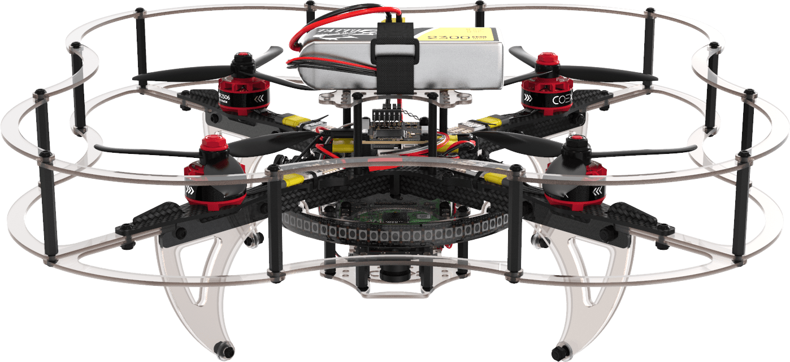

# Development of Quadcopter for Autonomous Navigation

## Table of Contents

* [Preface](#preface)
  * [Preface - Introduction & Background](#preface---introduction--background)
  * [Preface - Proposed Experimental Details](#preface---proposed-experimental-details)
  * [Preface - Measure of Success](#preface---measure-of-success)
  * [Preface - Conclusion](#preface---conclusion)
* [Prototype](#prototype)
* [Supplementary Materials](#supplementary-materials)
  * [ROS2 Rolling Installation - Ubuntu 22.04](#ros2-rolling-installation---ubuntu-2204)
  * [ROS Installation - NixOS](#ros-installation---nixos)
  * [ROS1 Noetic Installation - Ubuntu 22.04](#ros1-noetic-installation---ubuntu-2204)
  * [Installing VirtualBox - Ubuntu 22.04](#installing-virtualbox---ubuntu-2204)
  * [Using clover_vm for simulating Clover](#using-clover_vm-for-simulating-clover)
    * [clover_vm - Setup](#clover_vm---setup)
    * [clover_vm - General Usage](#clover_vm---general-usage)
  * [Installing Docker - Ubuntu 22.04](#installing-docker---ubuntu-2204)
  * [Miscellaneous](#miscellaneous)
* [References](#references)

## Preface

Here I outline a project involving the development of a quadcopter
capable of autonomous navigation. Additionally, I document how to set
up a simulation environment for developing with
[the drone platform](https://clover.coex.tech/en/) we will use for
this project. To skip to the simulation instructions, see
[Prototype](#prototype).

---

Simon J. Jones  
Daniel Willey, PhD  
Janyl Jumadinova, PhD

Fall 2023

*Department of Physics*  
*Department of Computer and Information Science*  
*Allegheny College, Meadville, PA 16335*

### Preface - Introduction & Background

Robotic navigation is the ability of an autonomous system to determine a
course of action to avoid colliding with an obstacle. Navigation is
necessary for a robot to interact with a real world scenario and to
realize technologies such as fully autonomous vehicles. Modern robotics
use either ranging sensors (acoustic or optical) or camera information
to interpret the relative position of obstacles; however, interpreting
reliable and fast 3D spatial data via a camera, called optical flow,
requires extensive training and large amounts of data. Although recent
work has enabled a racing quadcopter to outperform professional pilots,
boasting a speed of $22\\frac{\\text{m}}{\\text{s}}$ using only an
optical flow model, training a model from ranging sensor data is much
simpler compared to that of system using a camera for image-based
ranging, which is important when considering the feasibility of this
project. (Song et al. 2023) Ranging sensors can supply scalar
interpretations of the distance between the sensor and the obstacle.
Supplying an array of spatial measurements in the form of a tensor can
be used to train a machine learning model capable of avoiding collisions
while navigating a robot. In the past decade, Deep Reinforcement
Learning (DRL) has emerged as a viable form of unsupervised learning
that allows a model to adapt itself by comparing its performance to a
base metric that defines ‘good’ and ‘bad’ results. (Zhu and Zhang 2021)
Recently, it has been shown that combining DRL with other learning
algorithms has prevented the learning process from tending toward a
local minima rather than the desired global minima. (Hodge, Hawkins, and
Alexander 2021)

### Preface - Proposed Experimental Details

The chosen quadcopter platform is the drone, which uses open source
software, ideal for our purpose. (“COEX Clover,” n.d.) The Clover can be
integrated with any sensor thanks to its on-board Raspberry Pi 4 (RPi4);
thus, we will opt to use an array of ToF sensors to measure spatial
data. This is, by definition, a LiDAR system. The Clover supports the
MAVROS protocol, which permits a communication channel between the
on-board computer (RPi4) and the drone’s flight controller. The Clover
also supports the *Robotic Operating System* (ROS), which is a
collection of software and methodologies that generalize robotics
development. (Stanford Artificial Intelligence Laboratory et al., n.d.)

<figure>

<figcaption aria-hidden="true">COEX Clover quadcopter. <span
class="citation" data-cites="clover">(<span>“COEX Clover,”</span>
n.d.)</span></figcaption>
</figure>

We will start by simulating runs of the Clover using *Gazebo*, a visual
simulation program compatible with ROS. (Robotics, n.d.) Gazebo has a
built-in physics engine, and, COEX has supplied documentation outlining
how to simulate the Clover using this tool. We will then begin to
integrate DRL into this process in order to discover ways to effectively
train a model for navigation. During this stage, we will review more
literature on DRL and develop a deeper understanding of the mathematics
behind DRL.

As our simulations reach observable consistency, we will then consider
running this model on a real-time system. This will certainly produce
unexpected results, with various factors such as fluctuations in air
viscosity and wind currents capable of skewing the expected behavior of
a model. We will most likely spend time troubleshooting the model’s
control loop so that it can handle real-world conditions during this
time.

Once we have a model that consistently controls the quadcopter outside
of a simulation, we will focus on training the model to navigate
increasingly complex environments. This will most likely be doing using
iterations of arbitrary 3D shapes in a simulation. We plan to use sheets
of cardboard, or some other cheap material, to create obstacles to use
in our testing.

### Preface - Measure of Success

During the final stages of this project, we will evaluate the
effectiveness of the quadcopter in its ability to navigate through
random configurations of obstacles in comparison with results found in
the literature. We will first need to determine a metric for calculating
what defines the navigability of a space. Then, we will be able to view
the performance of the model with respect to the navigabililty metric to
provide a quantitative evaluation of our model.

### Preface - Conclusion

Autonomous systems capable of navigation will be integral to a society
based upon autonomous transportation and delivery. Exploring a current
approach to training an autonomous system will allow me to shape my
understanding of DRL and form a basis for working with other advanced
techniques of machine learning. Future students will be able to use the
COEX Clover to do similar work as the field evolves, as this provides
another platform for students to engage in robotics at Allegheny.

Finally, the aim of this project is to explore and evaluate the use of
LiDAR sensing in the current era of robotics. Although robotics is
growing rapidly, these principles will be applicable for decades ahead,
and this will work will benefit not only myself but also future students
at Allegheny with an interest in autonomous systems.

## Prototype

This repository is work toward simulating the COEX Clover drone in the
Robotic Operating System (ROS). By following the steps here, you will
have a simulation environment set up for the COEX Clover drone, and
you will be able to have it perform basic maneuvers from the command line.

First, please refer to
[Using clover_vm for simulating Clover](#using-clover_vm-for-simulating-clover)
in order to properly set up a virtualized development environment.

Assuming you have a working `clover_vm`, you can now clone this repository.

```sh
git clone https://ReadyResearcher-2023-24/SimonJonesArtifact.git
```

Now launch the Clover simulation. This will open a visual instance of Gazebo and
a PX4 SITL instance (flight controller simulator) in the terminal.

```sh
roslaunch clover_simulation simulator.launch
```


In a separate terminal, launch the `myflight.py` file from the repository you
just cloned.

```sh
cd /repo/just/cloned
python3 src/myflight.py
```

You should now see the following:

```
Press one of the following keys to perform a command, followed by [ENTER].

        [SPACE] .. up
        [X] ...... down
        [A] ...... left
        [D] ...... right
        [W] ...... forward
        [S] ...... backward

        [Q] ...... quit
        [R] ...... reset world
        [L] ...... land
```

Play with these commands while paying attention to the Gazebo simulation window
to see how the drone responds to input.

## Supplementary Materials

The information provided here is as reference. It does not necessarily
apply to this part of the project, but it corresponds to useful
information either peripheral or integral to this project.

### ROS2 Rolling Installation - Ubuntu 22.04

* Set locale

  ```sh
  locale  # check for UTF-8

  sudo apt update && sudo apt install locales
  sudo locale-gen en_US en_US.UTF-8
  sudo update-locale LC_ALL=en_US.UTF-8 LANG=en_US.UTF-8
  export LANG=en_US.UTF-8

  locale  # verify settings
  ```

* Ensure Ubuntu Universe repository is enabled

  ```sh
  sudo apt install software-properties-common
  sudo add-apt-repository universe
  ```

* Add ROS2 GPG key with apt

  ```sh
  sudo apt update && sudo apt install curl -y
  sudo curl -sSL https://raw.githubusercontent.com/ros/rosdistro/master/ros.key -o /usr/share/keyrings/ros-archive-keyring.gpg
  ```

* Add ROS2 repository to your sources list

  ```sh
  echo "deb [arch=$(dpkg --print-architecture) signed-by=/usr/share/keyrings/ros-archive-keyring.gpg] http://packages.ros.org/ros2/ubuntu $(. /etc/os-release && echo $UBUNTU_CODENAME) main" \
    | sudo tee /etc/apt/sources.list.d/ros2.list > /dev/null
  ```

* Update your apt repository caches after setting up the repositories. Do not
  skip this step.

  ```sh
  sudo apt update
  sudo apt upgrade
  ```

* Install `ros-rolling-desktop`

  ```sh
  sudo apt install ros-rolling-desktop
  ```

* Install `ros-rolling-ros-base`

  ```sh
  sudo apt install ros-rolling-desktop
  ```

* Set up environment by sourcing ROS2 `setup.bash`, `setup.sh`, etc.

  ```sh
  . /opt/ros/rolling/setup.bash
  ```

* Try out examples and read tutorials.

### ROS Installation - NixOS

This section is a work in progress. Feel free to contribute.  

* FIXME

  ```sh
  FIXME
  ```

### ROS1 Noetic Installation - Ubuntu 22.04

* Because ROS Noetic does not support Ubuntu 22.04 you either have to
  1. Build from source
  2. Use a docker container (recommended)
* This assumes you have `docker` installed. See
  [Installing docker - Ubuntu 22.04](#installing-docker---ubuntu-2204) for details.

* Pull docker image with tag for `noetic-desktop-full`.
  For more tags, see [this link](https://hub.docker.com/r/osrf/ros/tags)

  ```sh
  docker pull osrf/ros:noetic-desktop-full
  ```

#### Creating a catkin Package

Every catkin package follows a set of rules:

* It contains a `package.xml` file.
* It contains a `CMakeLists.txt` file which uses catkin.
* Each package must have its own folder

```txt
# example package tree

my_package/
  CMakeLists.txt
  package.xml
```

To create a catkin package, you must already have a workspace initialized.
Initializing a catkin workspace is as simple as running `mkdir -p
path/to/workspace/src; cd path/to/workspace; catkin_make`. After entering the
workspace root, you can run the following command:

```sh
catkin_create_pkg <package_name> [depend1] [depend2] [depend3]
```

After creating a package, you must rebuild the workspace in order for the proper
shell sourcing to happen.

```sh
cd ~/my_workspace
catkin_make
# now we can source the setup.[sh|bash|zsh] file
. ~/catkin_ws/devel/setup.sh
```

### Installing VirtualBox - Ubuntu 22.04

[See here](https://www.virtualbox.org/wiki/Linux_Downloads#Debian-basedLinuxdistributions)
for info from VirtualBox.  

* Download VirtualBox public key, convert to a GPG key, and add to keyring.

  ```sh
  wget -O- https://www.virtualbox.org/download/oracle_vbox_2016.asc | sudo gpg --dearmor --yes --output /usr/share/keyrings/oracle-virtualbox-2016.gpg
  ```

* Add VirtualBox's package list to the system.

  ```sh
  sudo echo "deb [arch=amd64 signed-by=/usr/share/keyrings/virtualbox.gpg] https://download.virtualbox.org/virtualbox/debian jammy contrib" > /etc/apt/sources.list.d/virtualbox.list
  ```

* Install VirtualBox.

  ```sh
  sudo apt update
  sudo apt install virtualbox-7.0
  ```

* NOTE: before running, check if `virtualbox-dkms` is installed. You don't want
  it installed. (see [this askubuntu article](https://askubuntu.com/questions/900794/virtualbox-rtr3initex-failed-with-rc-1912-rc-1912))

  ```sh
  dpkg -l | grep virtualbox-dkms
  ```

  * If this command shows that `virtualbox-dkms` was found in your system,
    uninstall it and install the package `dkms`.

    ```sh
    sudo apt-get purge virtualbox-dkms
    sudo apt-get install dkms
    ```

  * Now, rebuild VirtualBox kernel modules.

    ```sh
    sudo /sbin/vboxconfig
    ```

* Otherwise, you can now run VirtualBox

  ```sh
  VirtualBox
  # or
  VirtualBoxVM --startvm <vm-name>
  ```

### Using `clover_vm` for simulating Clover

The [clover_vm](https://github.com/CopterExpress/clover_vm) image is helpful in
getting started simulating clover. The documentation can be found
[here](https://clover.coex.tech/en/simulation_vm.html).

#### `clover_vm` - Setup

* Download `clover_vm` image from
  [releases page](https://github.com/CopterExpress/clover_vm/releases/). Select
  the latest release and download. These are multigigabyte files, so they will be
  time consuming to download. Ensure you have enough space.
* Ensure you have VirtualBox installed. See
  [Installing VirtualBox - Ubuntu 22.04](#installing-virtualbox---ubuntu-2204)
  for details.
* Set up the `clover_vm`. Note that this can be done through using
  `virtualbox`'s GUI.

  ```sh
  vboxmanage import /path/to/clover_vm.ova
  ```

* Launch `virtualbox`

  ```sh
  VirtualBoxVM --startvm clover-devel
  ```

* Select the image named **clover-devel**.
* Change its settings such that it has at least 4GB of memory and, preferably,
  as many cores as your system.
* Now that the image is fully configured, select **Start**.

#### `clover_vm` - General Usage

* In the virtual machine, Open a terminal and launch the simulation. Sourcing
  will already be done, because the virtual machine is preconfigured. This opens
  a Gazebo instance and a PX4 SITL simulation in the console. The Gazebo
  instance is what you'll want to refer back to.

  ```sh
  roslaunch clover_simulate simulator.launch
  ```

* In a new terminal, run one of the python scripts in `~/examples/` using `python3`.

  ```sh
  python3 examples/flight.py # this is a fun one
  ```

* Refer back to the open Gazebo instance to see the drone begin to arm. The
  expected behavior is that the drone takes off, moves one meter horizontally,
  and lands again.
* Now you've demonstrated that your system can simulate the Clover!

#### `clover_vm` - Setting up `clover_train`

```sh
# FIXME
```

### Installing Docker - Ubuntu 22.04

* Update the system

  ```sh
  sudo apt update
  ```

* Add dependencies to install docker

  ```sh
  sudo apt install apt-transport-https ca-certificates curl software-properties-common
  ```

* Add the official Docker key to avoid non-authentic packages

  ```sh
  curl -fsSL https://download.docker.com/linux/ubuntu/gpg | sudo gpg --dearmor -o /usr/share/keyrings/docker-archive-keyring.gpg
  ```

* Add the official Docker repo

  ```sh
  sudo add-apt-repository "deb [arch=amd64] https://download.docker.com/linux/ubuntu jammy stable"
  ```

* Install Docker

  ```sh
  sudo apt install docker-ce
  ```

* Docker should be installed, the daemon started, and the proces enabled to
  start on boot. Check that its running

  ```sh
  sudo systemctl status docker
  # it should say `active (running)`
  ```

### Miscellaneous

* [COEX Clover ROS docs](http://wiki.ros.org/Robots/clover)
* [COEX Clover Simulation VM](https://github.com/CopterExpress/clover_vm):
  simple way to get familiarized with simulating the Clover without installation process.
* Creating a new package in ROS2
  (see [here](https://docs.ros.org/en/rolling/Tutorials/Beginner-Client-Libraries/Creating-Your-First-ROS2-Package.html#create-a-package))

  ```sh
  ros2 pkg create --build-type ament_cmake <package_name>
  ros2 pkg create --build-type <build_type> --node-name <node_name> <package_name> --license <license>
  ```

* [ROS2 Command Line Syntax](https://design.ros2.org/articles/ros_command_line_arguments.html)
* [Colcon](https://docs.ros.org/en/rolling/Tutorials/Beginner-Client-Libraries/Colcon-Tutorial.html)
  is a tool used for managing and building ROS2 packages.
* LSP Integration
  * In order to get `clangd` to work with the libraries/headers in your project,
    set the following at the top of each `CMakeLists.txt` file in the projects
    you're working on:

    ```cmake
    # CMakeLists.txt
    set(CMAKE_EXPORT_COMPILE_COMMANDS ON)
    ...
    ```

* `clangd`: changing C++ standard being used:
  [this link](https://stackoverflow.com/questions/73758291/is-there-a-way-to-specify-the-c-standard-of-clangd-without-recompiling-it)

## References

Bogatov, N, A Kostin, and N Maiorov. 2021. “Control and Analysis of
Quadcopter Flight When Setting a Complex Trajectory of Motion.” In
*Journal of Physics: Conference Series*, 1925:012043. 1. IOP Publishing.

Cirtoaje, Cristina. 2021. “Ferroelectric Particles in Nematic Liquid
Crystals with Soft Anchoring.” *Molecules* 26 (4).
<https://doi.org/10.3390/molecules26041166>.

“COEX Clover.” n.d. <https://clover.coex.tech/en/>.

Hodge, Victoria J, Richard Hawkins, and Rob Alexander. 2021. “Deep
Reinforcement Learning for Drone Navigation Using Sensor Data.” *Neural
Computing and Applications* 33: 2015–33.

Iga, Kenichi. 2000. “Surface-Emitting Laser-Its Birth and Generation of
New Optoelectronics Field.” *IEEE Journal of Selected Topics in Quantum
Electronics* 6 (6): 1201–15.

Koyama, Fumio. 2014. “Advances and New Functions of VCSEL Photonics.”
*Optical Review* 21: 893–904.

Li, Nanxi, Chong Pei Ho, Jin Xue, Leh Woon Lim, Guanyu Chen, Yuan Hsing
Fu, and Lennon Yao Ting Lee. 2022. “A Progress Review on Solid-State
LiDAR and Nanophotonics-Based LiDAR Sensors.” *Laser & Photonics
Reviews* 16 (11): 2100511.

Mur, Urban, Miha Ravnik, and David Seč. 2022. “Controllable Shifting,
Steering, and Expanding of Light Beam Based on Multi-Layer
Liquid-Crystal Cells.” *Scientific Reports* 12 (1): 352.

Raj, Thinal, Fazida Hanim Hashim, Aqilah Baseri Huddin, Mohd Faisal
Ibrahim, and Aini Hussain. 2020. “A Survey on LiDAR Scanning
Mechanisms.” *Electronics* 9 (5): 741.

Robotics, Open. n.d. “Gazebo.” <https://gazebosim.org/home>.

Saleh, Bahaa EA, and Malvin Carl Teich. 2019. *Fundamentals of
Photonics*. John Wiley & sons.

Sciortino, Claudio, and Adriano Fagiolini. 2018. “ROS/Gazebo-Based
Simulation of Quadcopter Aircrafts.” In *2018 IEEE 4th International
Forum on Research and Technology for Society and Industry (RTSI)*, 1–6.
IEEE.

Song, Yunlong, Angel Romero, Matthias Müller, Vladlen Koltun, and Davide
Scaramuzza. 2023. “Reaching the Limit in Autonomous Racing: Optimal
Control Versus Reinforcement Learning.” *Science Robotics* 8 (82):
eadg1462.

Stanford Artificial Intelligence Laboratory et al. n.d. “Robotic
Operating System.” <https://www.ros.org>.

Zhang, Guanxiong, Steve J Elston, Andy Schreier, Grahame Faulkner,
Atchutananda Surampudi, Dominic O’Brien, and Stephen M Morris. 2023.
“Non-Mechanical Optical Beam-Steering of a Liquid Crystal Laser.”
*Optics & Laser Technology* 157: 108623.

Zhu, Kai, and Tao Zhang. 2021. “Deep Reinforcement Learning Based Mobile
Robot Navigation: A Review.” *Tsinghua Science and Technology* 26 (5):
674–91.
